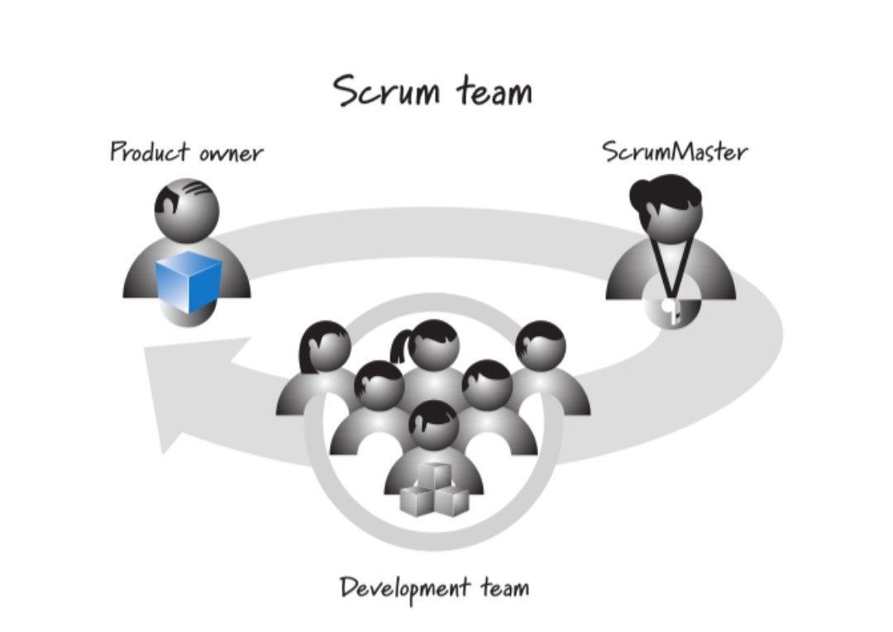
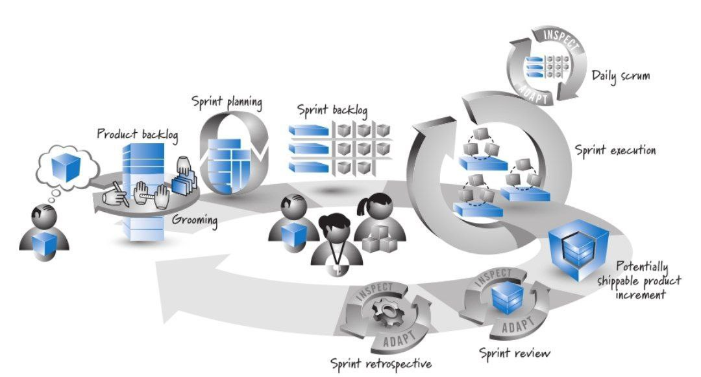
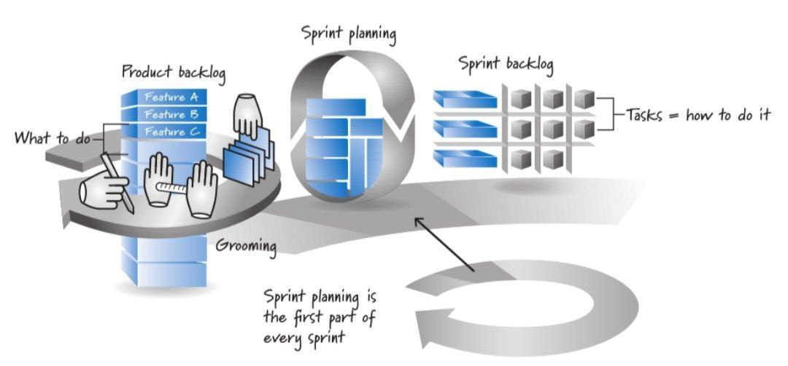
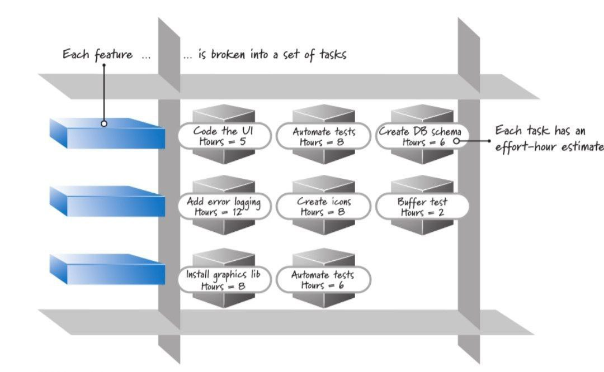
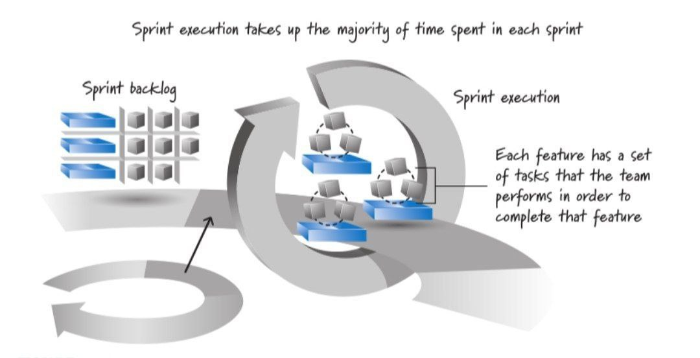
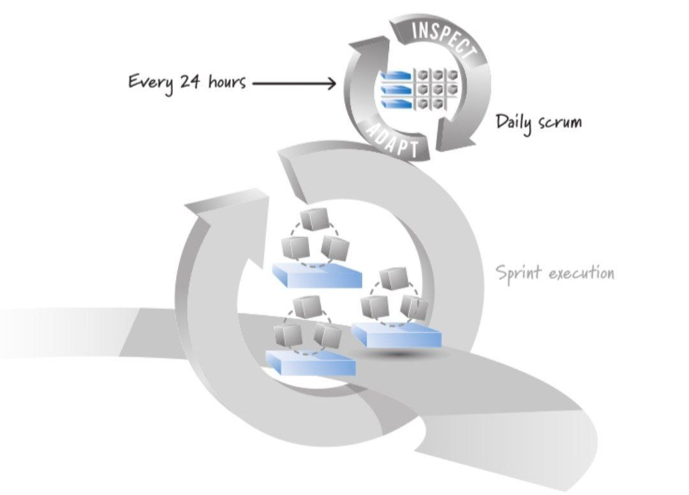
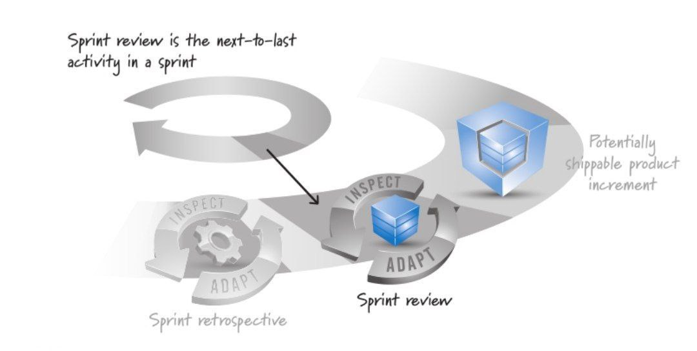
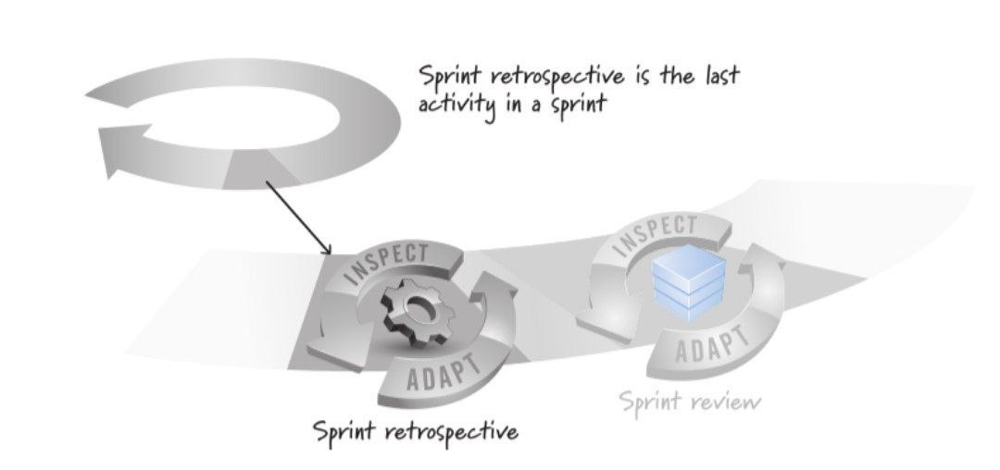

# چارچوب اسکرام
اسکرام چارچوبی برای اجرا و سازماندهی است . زیربنایی فراهم خواهد کرد تا پیاده سازی مناسب خود از فعالیت‌های مهندسی و تجربه‌های اسکرام را به ان بیافزاید که در نتیجه نسخه‌ای خاص و منحصر به‌فرد از اسکرام برای سازمان خواهد شد 

ارزش‌ها، اصول و تجربه‌های اسکرام ستون آن هستند که با پذیرش این واقعیت که میتواند تغییر کند روبرو هستیم اما ساختار داخلی آن را می‌توان چنان تغییر داد که فرآیندی مناسب ایجاد کند. اسکرام چارچوبی ساده، انسان محور و کبتمی بر ارزش‌های صداقت، شفافیت، شجاعت، احترام، تمرکز، اعتماد، توانمندسازی و همکاری است

### نقش‌های اسکرام:
اسکرام در قالب یک یا چند تیم انجام می‌شود. هر تیم از سه نقش تشکیل شده است: مالک محصول، استاد اسکرام و تیم توسعه. ممکن است نقش‌های دیگری نیز در سازمان وجود داشته باشد اما اسکرام به این سه نقش اکتفا می‌کند 
مالک محصول مسئولیت انتخاب ویژگی‌ها و ترتیب انجام آن است
استاد اسکرام راهنمای اعضای تیم است تا فرآیند منحصر به‌فرد خود را مبتنی بر چارچوب اسکرام ایجاد و اجرا کنند
تیم توسعه مسئول تعیین چگونگی تحقق خواسته‌های مالک محصول است

### مالک محصول
کانون اصلی و قدرتمند رهبری محصول است. مرجع تصمیم گیری برای انتخاب ویژگی‌های محصول و ترتیب ساخت آنهاست که با همکاری ذینفعان، چشم‌انداز روشنی از کار تیم اسکرام تهیه میکند و به روز نگه میدارد. مسیول توسعه سیستم جدید یا نگهداری سیستم موجود است. وظیفه اطمینان از انجام با ارزشترین کارها برعهده اوست که احتمالا شامل کارهای فنی نیز می‌شود. در اسرع وقت برای پاسخگویی حاضر باشد 

### استاد اسکرام
به کسانی که در حال یادگیری و وذیرش ارزش‌ها، اصول و تجربه‌های اسکرام هستند، کمک می‌کند. رهبری اسکرام را برعهده و به تیم و سازمان کمک میکند تا رویکردی کبتنی بر اسکرام ایجاد کنند. اگر چالشی وجود داشته باشد که تیم نتواند از عهده آن بر بیاید نقش تسهیل کننده ایفا میکند و وظیفه حفاضت از تیم در برابر موانع و عوامل مزاحم بیرونی را دارد و بعنوان رهبر عمل کرده تا بهره وری را افزایش دهد. مجاز به اعمال کنترل بر تیم نیست و نقش مدیریتی ندارد 

### تیم توسعه
گروهی از افراد با مهارت و تخصص‌های گوناگون که مسئول طراحی، ساخت و ازمایش هستند در گذشته با عنوان‌های معمار نرم‌افزار، برنامه نویس، ازمونگر، طراح رابط کاربری و ... مطرح می‌شد. تیم مختار است تا بهترین شیوه برای تحقق هدف مالک محصول را انتخاب کند. که شامل پنج تا نه نفر است که باید مهارت لازم برای تولید نرم افزار با کیفیت را داشته باشند. اسکرام میتواند در تیم‌های بزرگتر تا ۳۵ نفر هم اجرا شود اما بهتر اس در ۴ تیم نه نفره قرار گیرند

فعالیت‌ها و فرآورده اسکرام در تصویر مطابق فلش زیرین پیش میریم

مالک محصول چشم‌اندازی از محصول در اختیار دارد با حجم بالا که با استفاده از فعالیت با عنوان «آماده سازی» به مجموعه شکسته‌ای از ویژگی‌های اولویت بندی شده با نام «بک‌لاگ محصول» در می‌آورد.
اسپرینت با برنامه ریزی شروع میشه با انجام کارهای توسعه در طول اسپرینت که اجرای اسپرینت نامیده می‌شود ادامه و با «بازنگری» و «بازاندیشی» اسپرینت(فلش بزرگ زیرین) پایان می‌یابد. بک‌لاگ محصول بزرگتر از حد توان تیم توسعه است که در یک اسپرینت تمام شود لذا تیم توسعه مشخص میکند در طول اسپرینت چه اقلامی را می‌تواند به اتمام برساند که به آن «بک‌لاگ اسپرینت» میگوییم

نتیجه اسپرینت را «پیش‌بینی» یا «تعهد» گویند. ما در طول کتاب تعهد گوییم مکر جایی که پیش‌بینی لفظ بهتری باشد. بک‌لاگ اسپرینت شامل کارها و وظایف برنامه ریزی شده تیم برای طراحی، ساخت، یکپارچه‌سازی و آزمون ویژگی‌های انتخاب شده در اسپرینت است. مرحله بعد اجرای اسپرینت است که تیم وظایف لازم را برای تحقق ویژگی‌ها انجام می‌دهد. برنامه‌ریزی برای ایجاد هماهنگی، بازرسی و تطبیق در هر روز از اجرای اسپرینت با فعالیتی به نام اسکرام روزانه انجام می‌شود که هدف آن کمک به به مدیریت کارهاست. بعد پایان اسپرینت بخش قابل عرضه‌ای از محصول تولید می‌شود که قسمتی از چشم انداز موردنظر مالک است. اسپرینت با انجام دو فعالیت «بازرسی» و «تطبیق» به پایان می‌رسد. فعالیت اول «بازنگری اسپرینت» ذینفعان و تیم اسکرام محصول را بررسی می‌کند. در فعالیت دوم «بازاندیشی اسپرینت» فرآیند ساخت محصول بررسی می‌شود. فعالیت اول ممکن از تغییراتی در بک‌لاگ محصول و فعالیت دوم موجب تغییراتی در فرآیند توسعه شود.

با تعیین اقلام با اهمیت بک‌لاگ‌ محصول که تیم توان تحویل آنرا دارد، اسپرینت تکرار می‌شود. چشم انداز مالک محصول پس از چند اسپرینت روشن و محصول منتشر می‌شود

### بک لاگ محصول:
در اسکرام با ارزشترین کارها زودتر انجام می‌شوند. مالک محصول مسئول نهایی تعیین و‌مدیریت توالی انجام آن است و این کار را با دریافت اطلاعات از تیم توسعه و ذینفعان انجام می‌دهد. بک لاگ محصول جدید در ابتدا حاوی ویژگی‌ها و امکانات مورد نیاز است جهت تحقق چشم انداز مالک محصول، اما بک لاگ محصولی که در حال تکمیل است شامل ویژگی‌های جدید، تغییرات ویزگی‌های موجود، نقص‌ها، بهبودهای فنی و موارد مشابه است، مالک محصول با همکاری ذینفعان بک‌لاگ محصول را جمع آوری و تعریف می‌کند و مطمئن می‌شود که اقلام با ترتیب درستی یعنی بر اساس معیارهایی مانند ارزش، هزینه و ریسک در بک‌لاگ قرار گرفته باشد. بک‌لاگ فرآورده‌ای که همواره در حال تکمیل است. مالک محصول میتواند بر حسب شرایط گوناگون بک‌لاگ را اضافه حذف یا اصلاح کند

فعالیت ایجاد، اصلاح، برآورد و اولویت بندی اقلام بک‌لاگ محصول «آماده‌سازی» نامیده می‌شود

اندازه هر قلم از اقلام موجود در بک‌لاگ برابر با هزینه انجام آن است که مالک محصول جهت اولویت‌بندی (مرتب سازی/سازماندهی) بک لاگ درست، لازم است آن را بداند. اسکرام برای اندازه کیری اقلام روشی را اجبار نمی‌کند اما در بسیاری از تیم‌ها از واحدهای نسبی مانند «امتیاز داستان» یا «روز ایده‌آل» استفاده می‌کنند. در این روش‌ها فقط به نسبت اندازه یک قلم به سایر قلم‌ها توجه می‌کنند 

### اسپرینت:
در اسکرام کارها در یک دوره یکماه انجام میشود که به آن اسپرینت میگوییم، خروجی هر اسپرینت باید ارزشمند و ملموس برای ذینفعان باشد، اسپرینت‌ها دوره‌های زمانی ثابت دارند تاریخ شروع و پایان آن و مشخص و غیر تغییر پذیری خواهد بود. مدت زمان ان بهتر است همیشه ثابت باشد و بعد از پایان یکی ،دیگری آغاز می‌شود هیچ‌گونه تغییری در افراد تیم و محدوده کار مجاز نیست

### برنامه ریزی اسپرینت:
حجم کارها در بک‌لاگ بیشتر از انجام آن در یک اسپرینت است. ازین جهت تیم اسکرام (تیم اسکرام شامل تیم توسعه -از سه تا هشت نفر است- مالک محصول و استاد اسکرام است) برنامه ریزی اسپرینت را با هدف تعیین مهمترین اقلام بک‌لاگ محصول برای انجام در اسپرینت جاری برگزار می‌کنند.

در برنامه ریزی، نچتیم توسعه همراه با مالک محصول بر روی هدف اسپرینت توافق می‌کنند. هدف اسپرینت بیانگر دستاوردهای مورد انتظار در پایان است. تیم توسعه با استفاده از هدف، بک‌لاگ را مرور و مهمترین اقلام را انتخاب می‌کنند. تیم توسعه اقلام رو به ویژگی‌های مختلفی شکسته که به آن بک‌لاگ اسپرینت می‌گویند. برای ویژگی‌ها مدت زمان برآورد می‌کنند این شکستن اقلام به مجموعه وظایف نوعی طراحی و برنامه ریزی به موقع است. برای برنامه ریزی اسپرینت در ازای هر هفته دو ساعت، تیم توسعه زمان می‌گذارد. رویکرد بسیار ساده این است یک قلم را برداشته و ان را به مجموعه وظایف بشکنید و مطمئن شوید انجام آن به همراه اقلام انتخاب شده‌ی قبلی برای اسپرینت جاری امکان پذیر است. این چرخه برداشتن قلم و شکستن آن تا زمان وجود ظرفیت خالی و تکمیل آن ادامه می‌یابد. تصویر

رویکرد دیگر این است که تیم توسعه همراه مالک محصول، اقلام رو از بک‌لاگ برداشته و بدون حضور مالک شروع به شکستن آن به مجموعه وظایف قابل انجام پذیر می‌کند 

### اجرای اسپرینت:
پس از برنامه ریزی و توافق، تیم با هدایت استاد انجام می‌دهد. وظایف تیم می‌تواند فقط نرم افزاری و یا ترکیب آن با کارهای سخت افزاری و بازاریابی باشد. چگونگی و انجام وظایف (بک‌لاگ اسپرینت) را کسی به تیم توسعه تحمیل نمی‌کند بلکه اعضا خود انتخاب و برنامه ریزی کرده و برای تحقق اهداف اسپرینت سازماندهی می‌کند.

### اسکرام روزانه:
جلسه اسکرام روزانه هر روز از اسپرینت و در یک بازه زمانی مشخص (ابتدای روزکاری/انتهای روز کاری) و بمدت حداکثر ۱۵ دقیقه انجام می‌دهند. این جلسات کوتاه و ایستاده صورت میگیرد که به آن «جلسه ایستاده روزانه» می‌گویند 

این جلسه بین اعضای تیم جهت اطلاع و با کمک استاد به سه پرسش پاسخ میدهند:
چه کارهای در روز انجام داده‌اید؟
چه کارهایی در روز میخواهید انجام دهید؟
چه مشکلات و موانعی جلوی پیشرفت من را گرفته؟

به این ترتیب اعضای تیم سریع میزان تحقق، تغییرات برنامه روز جاری، کارهای ضروری و فوری قرار می‌گیرند. اسکرام روزانه امری مهم برای کمک به تیم و بمنظور مدیریت سریع و انعطاف کاری است. اسکرام روزانه محلی برای رفع مشکلات نیست (مشکلات بعد از جلسه روزانه در قالب تیم کوچک و با حضور افراد علاقمند صورت می‌گیرد) در جلسات روزانه با جلسات مرسوم گزارش وضعیت کار و جلسات ویژه دعوت مدیر پروژه متفاوت است. در جلسات روزانه دو دسته داریم دسته اول شنونده که متعهد به انجام کاری نیستند و دسته دوم کسانی که صحبت میکنند و متعهد به انجام کاری هستند هستند

### انجام شده:
نتیجه هر اسپرینت بخشی از محصول است که قابلیت عرضه شدن دارد که بر اساس توافق صورت گرفته تمام شده است. واژه انجام شده می‌تواند به معنای طراحی، ساخت، یکپارچه سازی، آزمون و مستندسازی باشد 

با این اوصاف و تعریف از واژه انجام شده سازمان می‌تواند ارزیابی کند که در صورت استقرار(عرضه) چه چیزی عاید مشتریانش خواهد شد. انجام شده به معنای تحویل نیست، واژه تحویل محصول، تصمیمی در سطح مدیران کسب و کار است که متاثر از موضوعات زیر است:
آیا ویژگی‌های اضافه شده برای استقرار نسخه جدید کافی است؟
ایا بخشی از فرآیندهای مشتری که در محصول پوشش داده شده، استقرار نسخه جدید را توجیه می‌کند؟
با توجه به اخرین نصب محصول (اسپرینت قبلی) کاربران آمادگی پذیرش تغییرات جدید را دارند؟
مفهوم تحویل معیار مناسبی برای کسب اطمینان از کامل شدن کارهای اسپرینت است چرا که وقتی کسب و کار بخواهد محصول را به مشتری بدهد نباید کار مهمی مانند آزمون یا یکپارچه سازی تا پایان اسپرینت باقی مانده باشد

### بازنگری اسپرینت:
در پایان اسپرینت دو‌فعالیت دیگر بازرسی و تطبیق نیز انجام میشود.
هدف از بازنگری اسپرینت، بازبینی و منطبق سازی محصول در حال ساخت است. نکته اساسی این فعالیت گفتگو و نشستی میان همه دست اندرکاران از جمله اعضای تیم اسکرام، ذینفعان، حامیان مالی، مشتریان مدعو از سایر تیم‌ها انجام می‌شود که هدف آن بازنگری ویژگی‌های کامل شده در اسپرینت است. که موجب می‌شود تیم مسیر روشنی داشته و مطابق با اهداف کسب و کار پیش برود.

بازنگری موجب ایجاد گردش اطلاعاتی دو سویه شده و افراد بیرون از اسکرام به تیم‌ در مسیر آتی کمک می‌کنند (تیم بازخوردهای زیادی دریافت خواهد کرد) و موجب میشود تیم درک بهتری از جنبه‌های بازاریابی و تجاری کسب کند (فرصتی مناسب جهت بازرسی و تطبیق محصول تلقی می‌شود) افراد شرکت کننده با مرور ویژگی‌های اسپرینت جاری و ارائه‌ی نظراتشان به تیم کمک کنند تا بهتر به اهداف اسپرینت دست یابند

### بازاندیشی اسپرینت:
دومین فعالیت بازرسی و تطبیق در پایان اسپرینت است.(پس از بازنگری اسپرینت جاری و پیش از برنامه ریزی اسپرینت بعدی)
بازاندیشی فرصتی برای بازرسی و تطبیق فرایند انجام کار است (بازنگری فرصتی برای بازرسی و تطبیق محصول است) که در آن تیم اسکرام در خصوص کارایی شیوه اسکرامی خود و تجربه‌های فنی مرتبط با آن گفتگو می‌کنند که تاکید بر بهبود مستمر فرآیند است تا تیم اسکرام به تیمی فوق‌العاده تبدیل شود در پایان تیم مواردی را برای بهبود فرآیند شناسایی کرده و متعهد می‌شود در اسپرینت بعدی آنها را انجام دهد.

[نویسنده: بهزاد آزادی](https://github.com/behzad-azadi2693)

[وب سایت](https://codecrafters.ir)

[کانال تلگرامی](https://t.me/Code_Crafters)

